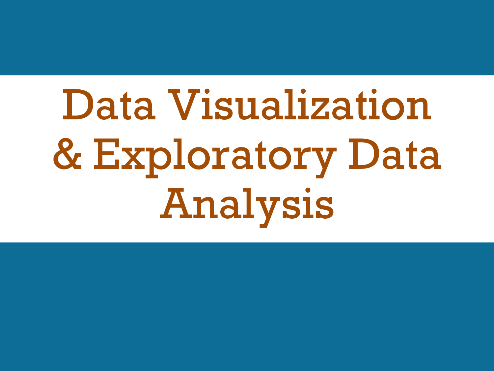

# Data Visualization and Exploratory Data Analysis

[Andrew Heiss](https://www.andrewheiss.com/) • Sanford School of Public Policy • Duke University  
Presentation given to MPP students  
January 22, 2014

---

This repository contains:

- [The PowerPoint file of the presentation](presentation/Data%20visualization%20old.pptx)
- [A PDF of the presentation](presentation/Data%20visualization%20old.pdf)
- [R code used to create graphs in presentation](Graphics%20code.R)
- PDFs of examples of [diff-in-diff analysis](files/Andrew%20Heiss%20-%20Assignment%202.pdf) and [regression discontinuity analysis](files/Andrew%20Heiss%20-%20Assignment%203.pdf)

---

