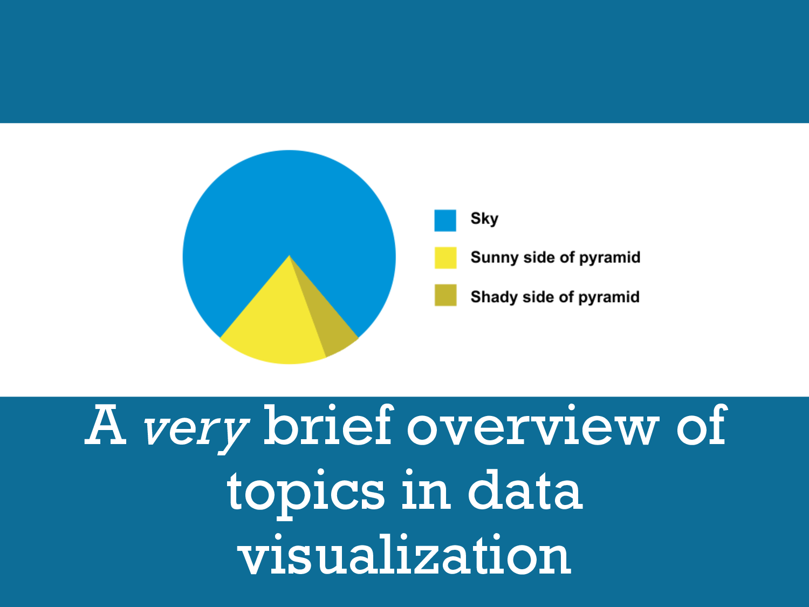

# A *Very* Brief Overview of Topics in Data Visualization

[Andrew Heiss](https://www.andrewheiss.com/) • Sanford School of Public Policy • Duke University  
Presentation given to MPP students  
September 15, 2015

---

This repository contains:

- [The PowerPoint file of the presentation](presentation/Intro%20to%20data%20visualization.pptx)
- [A PDF of the presentation](presentation/Intro%20to%20data%20visualization.pdf)
- [An Excel file with a graphic and data to redesign](files/better_excel.xlsx)

---

