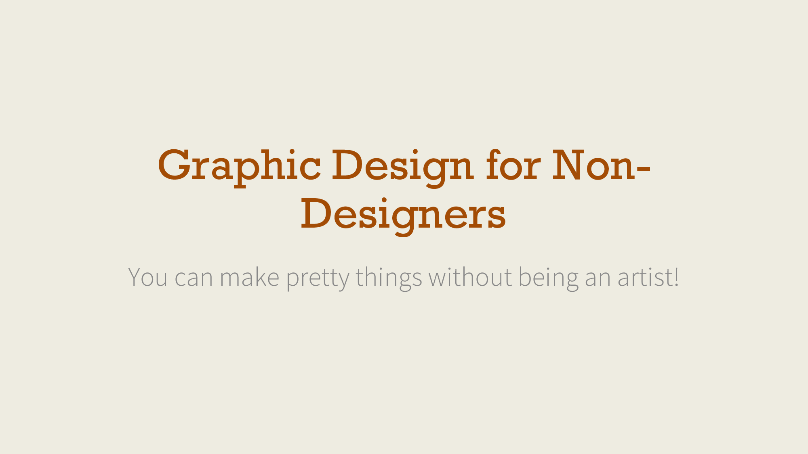

# Graphic Design for Non-Designers

[Andrew Heiss](https://www.andrewheiss.com/) • Sanford School of Public Policy • Duke University  
Presentation given to MPP students  
October 2, 2015

---

This repository contains:

- [The PowerPoint file of the presentation](presentation/Graphic%20design%20for%20non-designers.pptx)
- [A PDF of the presentation](presentation/Graphic%20design%20for%20non-designers.pdf)
- [An ugly PowerPoint file to redesign](files/FixMe.pptx)
- [An ugly Word file to redesign](files/fixme_report.docx)

---

