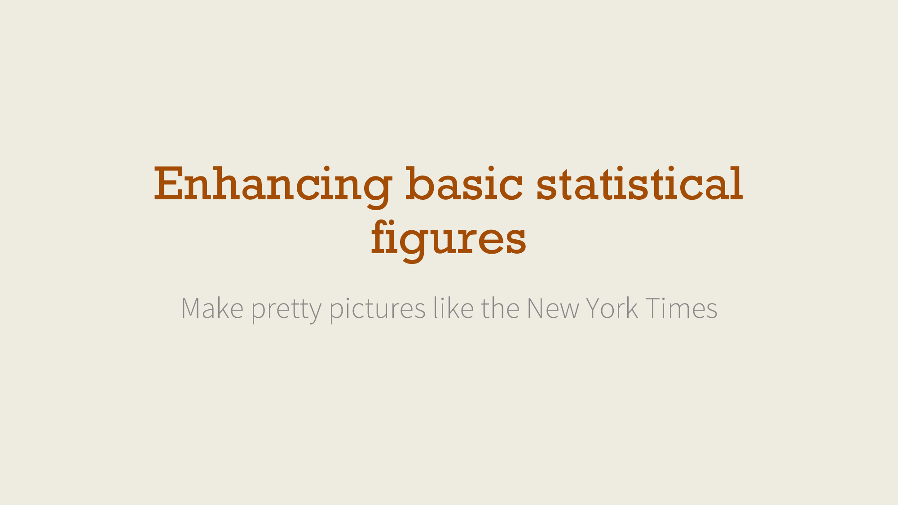

# Enhancing basic statistical figures: Make pretty pictures like the New York Times

[Andrew Heiss](https://www.andrewheiss.com/) • Sanford School of Public Policy • Duke University  
Presentation and workshop given to MPP students  
October 16, 2015

---

This repository contains:

- [The PowerPoint file of the presentation](presentation/Making%20pretty%20figures.pptx)
- [A PDF of the presentation](presentation/Making%20pretty%20figures.pdf)
- [A script with R and Stata commands to create basic hot dog graph](hotdogs.R)

---

