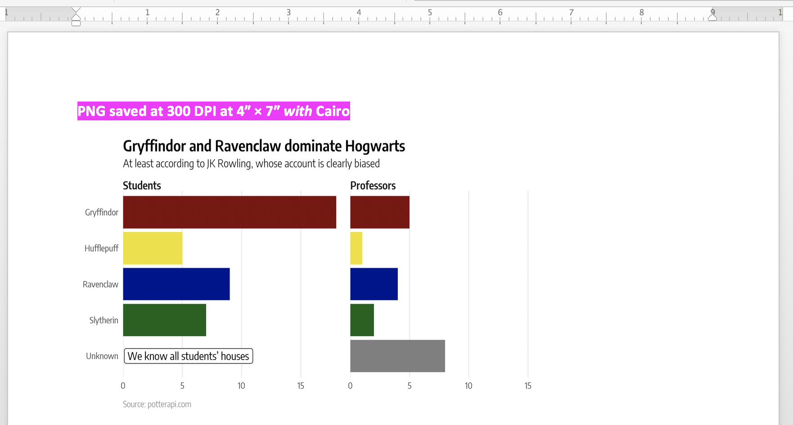

```{r setup, include=FALSE}
knitr::opts_chunk$set(fig.align = "center")
```

# Slides

This R Markdown file [is available on GitHub](https://github.com/andrewheiss/talks/tree/master/2018-07-11_utah-rug-dataviz).

[Download the slides from today's talk](presentation/andrew-heiss_2018-07-11_utah-rug-dataviz.pdf)

```{r first-slide, echo=FALSE, out.width='50%', fig.align='center'}

```


# Resources

## Books

If you want to learn enough graphic design to be dangerous, *get this book*:

- Robin Williams, *The Non-Designer’s Design & Type Books: Design and Typographic Principles for the Visual Novice, Deluxe Edition.* (Berkeley, California: Peachpit Press, 2008). (Or any more recent version too)

There are some helpful summary articles about CRAP principles online too:

- [It’s all C.R.A.P.: Four Principles of Design](http://www.thinkaroundcorners.com/2011/10/c-r-a-p-principles-design/)
- [Build Better User Experience With C.R.A.P. Design Principles](https://vwo.com/blog/crap-design-principles/)

There are a ton of excellent data visualization books, including two new (free!) books by Kieran Healy and Claus Wilke:

- [Kieran Healy, *Data Visualization for Social Science: A practical introduction with R and ggplot2*](http://socviz.co/)
- [Claus Wilke, *Fundamentals of Data Visualization*](http://serialmentor.com/dataviz/)
- Alberto Cairo, *The Truthful Art: Data, Charts, and Maps for Communication* (Berkeley, California: New Riders, 2016).
- Stephanie D. H. Evergreen, *Effective Data Visualization: The Right Chart for the Right Data* (Thousand Oaks, CA: Sage, 2017).
- Dona M. Wong, *The Wall Street Journal Guide to Information Graphics: The Dos and Don’ts of Presenting Data, Facts, and Figures* (London: W. W. Norton & Company, 2010).
- Hadley Wickham and Garrett Grolemund, *R for Data Science: Import, Tidy, Transform, Visualize, and Model Data* (Sebastopol, California: O’Reilly Media, 2017). [[FREE online](http://r4ds.had.co.nz/)]
- Alberto Cairo, *The Functional Art: An Introduction to Information Graphics and Visualization* (Berkeley, California: New Riders, 2013).

## How to select the appropriate chart type

Many people have created many useful tools for selecting the correct chart type for a given dataset or question. Here are some of the best:

- [**The Data Visualisation Catalogue**](http://www.datavizcatalogue.com/): Descriptions, explanations, examples, and tools for creating 60 different types of visualizations.
- [**The Data Viz Project**](http://datavizproject.com/): Descriptions and examples for 150 different types of visualizations. Also allows you to search by data shape and chart function (comparison, correlation, distribution, geographical, part to whole, trend over time, etc.).
- [**From Data to Viz**](https://www.data-to-viz.com/): A decision tree for dozens of chart types with links to R and Python code.
- [**The Chartmaker Directory**](http://chartmaker.visualisingdata.com/): Examples of how to create 51 different types of visualizations in 31 different software packages, including Excel, Tableau, and R.
- [**R Graph Catalog**](http://shinyapps.stat.ubc.ca/r-graph-catalog/): R code for 124 ggplot graphs.
- [**Emery's Essentials**](http://annkemery.com/essentials/): Descriptions and examples of 26 different chart types.

## Colors

- [**Adobe Color**](https://color.adobe.com): Create, share, and explore rule-based and custom color palettes.
- [**ColorBrewer**](http://colorbrewer2.org/): Sequential, diverging, and qualitative color palettes that take accessibility into account.
- [**viridis**](https://cran.r-project.org/web/packages/viridis/vignettes/intro-to-viridis.html): Percetually uniform color scales.
- [**Scientific Colour-Maps**](http://www.fabiocrameri.ch/colourmaps.php): Perceptually uniform color scales like viridis. Use them in R with [**scico**](https://github.com/thomasp85/scico).
- [**Colorgorical**](http://vrl.cs.brown.edu/color): Create color palettes based on fancy mathematical rules for perceptual distance.
- [**Colorpicker for data**](http://tristen.ca/hcl-picker/): More fancy mathematical rules for color palettes ([explanation](https://www.vis4.net/blog/posts/avoid-equidistant-hsv-colors/)).
- [**iWantHue**](http://tools.medialab.sciences-po.fr/iwanthue/): Yet another perceptual distance-based color palette builder.
- [**ColourLovers**](http://www.colourlovers.com/): Like Facebook for color palettes.
- [**Photochrome**](https://photochrome.io/): Word-based color pallettes.

## Fonts

- [**Google Fonts**](https://fonts.google.com/): Huge collection of free, well-made fonts.
- [**The Ultimate Collection of Google Font Pairings**](https://www.reliablepsd.com/ultimate-google-font-pairings/): A list of great, well-designed font pairings from all those fonts hosted by Google (for when you're looking for good contrasting or complementary fonts).

## Other helpful data visualization resources {#other-resources}

- [**Storytelling with Data**](http://www.storytellingwithdata.com/): Blog and site full of resources by Cole Nussbaumer Knaflic.
- [**Ann K. Emery's blog**](http://annkemery.com/blog/): Blog and tutorials by [Ann Emery](https://twitter.com/AnnKEmery).
- [**Evergreen Data**](http://stephanieevergreen.com/): Helful resources by [Stephanie Evergreen](https://twitter.com/evergreendata).
- [**PolicyViz**](https://policyviz.com/): Regular podcast and site full of helpful resources by [Jon Schwabisch](https://twitter.com/jschwabish).
- [**\@HelpMeViz**](https://twitter.com/HelpMeViz): Community of people who give advice on how to visualize data.
- [**Visualising Data**](http://www.visualisingdata.com/): Fantastic collection of visualization resources, articles, and tutorials by [Andy Kirk](https://twitter.com/visualisingdata).
- [**Info We Trust**](http://infowetrust.com/): Detailed explorations of visualizations by [RJ Andrews](https://twitter.com/infowetrust), including a [beautiful visual history of the field](http://infowetrust.com/history/).
- [**FlowingData**](https://flowingdata.com/): Blog by [Nathan Yau](https://twitter.com/flowingdata).
- [**Information is Beautiful**](http://www.informationisbeautiful.net/): Blog by [David McCandless](https://twitter.com/mccandelish).
- [**Junk Charts**](http://junkcharts.typepad.com/): Blog by [Kaiser Fung](https://twitter.com/junkcharts).
- [**WTF Visualizations**](http://viz.wtf/): Visualizations that make you ask "What the F^rea^k?"^[ `r emo::ji("speak_no_evil")` o hi byu! `r emo::ji("speak_no_evil")`]
- [**The Data Visualization Checklist**](http://annkemery.com/checklist/): A helpful set of criteria for grading the effectiveness of a graphic.
- [**Data Literacy Starter Kit**](https://docs.google.com/document/d/1kKRadOiF0LruItsvGA40fSDZkAQfCqC_Ela0gBdo8A4/edit): Compilation of resources to become data literate by [Laura Calloway](http://lauracalloway.com/).
- [**Seeing Data**](http://seeingdata.org/): A series of research projects about perceptions and visualizations.


# `r emo::ji("musical_notes")` Take a sad plot and make it CRAPier `r emo::ji("musical_notes")`

```{r load-packages-data, warning=FALSE, message=FALSE, include=TRUE}
library(tidyverse)
library(httr)
library(ggstance)
```

By default, R graphics don't really respect CRAP rules. In base R, everything is centered:

```{r crap-violations-base, fig.width=4, fig.height=3}
plot(mtcars$wt, mtcars$mpg, main = "Here's a title")
```

Nowadays in ggplot, titles are left aligned, but they used to be centered by default. Even so, now there are multiple alignments—things are aligned center and left (and right if you add a caption)

```{r crap-violations-ggplot, fig.width=4, fig.height=3}
ggplot(mtcars, aes(x = wt, y = mpg)) +
  geom_point() +
  labs(title = "Here's a title",
       caption = "I'm right aligned")
```

To get R graphics in a more publishable state, you have to tweak them a lot. It seems daunting at first, but most of the tweaks can be put in a custom theme that you can reuse over and over again.

First, let's get some data about characters in the Harry Potter series from the [Harry Potter API](https://www.potterapi.com). You'll need your own API key for this to work.

```{r fake-api-key, eval=FALSE}
HP_KEY <- "put-api-key-here"
```

```{r get-data, cache=TRUE}
response <- GET("https://www.potterapi.com/v1/characters/", query = list(key = HP_KEY))

parsed <- jsonlite::fromJSON(content(response, "text"), simplifyVector = FALSE)

characters <- bind_rows(parsed)
```

Next, do some quick data processing (which goes beyond the scope of this talk):

```{r student-prof-houses}
professors <- characters %>% 
  filter(str_detect(role, "[Pp]rofessor") | name == "Albus Dumbledore") %>% 
  mutate(type = "Professors")

students <- characters %>% 
  filter(str_detect(role, "[Ss]tudent"), str_detect(school, "Hogwarts School")) %>% 
  mutate(type = "Students")

hogwarts <- bind_rows(professors, students)

plot_houses_df <- hogwarts %>% 
  count(type, house) %>% 
  replace_na(list(house = "Unknown")) %>% 
  mutate_at(vars(type, house), funs(fct_rev(fct_inorder(., ordered = TRUE))))

plot_houses_df
```

The default ggplot settings create multiple alignments, have very little typographic contrast, and have some extra chart junk:

```{r hp-default}
# Non CRAPy default
ggplot(plot_houses_df, aes(x = n, y = house)) +
  geom_barh(stat = "identity") +
  labs(title = "Gryffindor and Ravenclaw dominate Hogwarts",
       subtitle = "At least according to J.K. Rowling, whose account is clearly biased",
       caption = "Source: potterapi.com") +
  facet_wrap(~ type)
```

## Making stuff CRAPier with `theme()`

We can fix alignment with some tweaks in `theme()`, left aligning the strip text and the caption. We can also use `scale_x_continuous(expand = c(0, 0))` to get rid of the gap between the axis labels and the start of the bars and add some extra space between the panels with `theme(panel.spacing.x = ...)`. Finally, we don't need axis titles here because it's fairly obvious what the axes are. If we needed them, we could change their alignment with `theme()` too.

```{r hp-alignment}
# Alignment
ggplot(plot_houses_df, aes(x = n, y = house)) +
  geom_barh(stat = "identity") +
  labs(title = "Gryffindor and Ravenclaw dominate Hogwarts",
       subtitle = "At least according to J.K. Rowling, whose account is clearly biased",
       caption = "Source: potterapi.com") +
  facet_wrap(~ type) + 
  labs(x = NULL, y = NULL) +
  scale_x_continuous(expand = c(0, 0)) +
  theme(strip.text = element_text(hjust = 0),
        plot.caption = element_text(hjust = 0, 
                                    margin = margin(t = 10)),
        panel.spacing.x = unit(1, "lines"))
```

We can also get rid of some bits of chart junk like minor gridlines, major y gridlines, axis ticks, etc. 

```{r hp-chart-junk}
# Chart junk
ggplot(plot_houses_df, aes(x = n, y = house)) +
  geom_barh(stat = "identity") +
  labs(title = "Gryffindor and Ravenclaw dominate Hogwarts",
       subtitle = "At least according to J.K. Rowling, whose account is clearly biased",
       caption = "Source: potterapi.com") +
  facet_wrap(~ type) + 
  labs(x = NULL, y = NULL) +
  scale_x_continuous(expand = c(0, 0)) +
  theme(strip.text = element_text(hjust = 0),
        plot.caption = element_text(hjust = 0, 
                                    margin = margin(t = 10)),
        panel.spacing.x = unit(1, "lines")) +
  theme(axis.ticks = element_blank(),
        panel.grid.major.y = element_blank(),
        panel.grid.minor = element_blank())
```

All those `theme()` settings are getting long and unwieldy. We can move them into a new custom theme. Technically, ggplot has `theme_replace()` and `%+replace%` for changing theme settings, but I don't like it as much as creating my own function, which I find more flexible and intuitive.

```{r hp-theme-1}
# Move all these tweaks to a new theme based on theme_bw()
theme_hp <- function() {
  new_theme <- theme_bw() +
    theme(strip.text = element_text(hjust = 0),
          strip.background = element_blank(),
          strip.text.x = element_text(margin = margin(l = 0, t = 5)),
          panel.spacing.x = unit(1, "lines"),
          plot.caption = element_text(hjust = 0, 
                                      margin = margin(t = 10)),
          axis.ticks = element_blank(),
          panel.grid.major.y = element_blank(),
          panel.grid.minor = element_blank(),
          panel.border = element_blank())
  
  return(new_theme)
}

ggplot(plot_houses_df, aes(x = n, y = house)) +
  geom_barh(stat = "identity") +
  labs(title = "Gryffindor and Ravenclaw dominate Hogwarts",
       subtitle = "At least according to J.K. Rowling, whose account is clearly biased",
       caption = "Source: potterapi.com") +
  scale_x_continuous(expand = c(0, 0)) +
  labs(x = NULL, y = NULL) +
  facet_wrap(~ type) + 
  theme_hp()
```

## Colors

There are lots of ways to work with colors in ggplot. With more recent versions of ggplot, you can use viridis palettes with `scale_color_viridis_c()` (for continuous data) or `scale_color_viridis_d()` (for discrete data). You can use [Scientific Colour-Maps](http://www.fabiocrameri.ch/colourmaps.php) with [**scico**](https://github.com/thomasp85/scico). You can also define your own palettes with a named list (so you can access colors like `my_colors$red`), with [your own fancy self-made palettes](https://drsimonj.svbtle.com/creating-corporate-colour-palettes-for-ggplot2), or even with a simple vector of colors (like `c("grey50", "#0d6217", "#000a90", "#eee117", "#7f0909")`, though this is hard because it's impossible to remember what the hex colors actually are).

```{r hp-colors}
# Colors
# via http://thisismyworld2003.blogspot.com/2016/03/hogwarts-house-colors.html
house_colors <- list(Gryffindor = "#7f0909",
                     Hufflepuff = "#eee117",
                     Ravenclaw = "#000a90",
                     Slytherin = "#0d6217")

ggplot(plot_houses_df, aes(x = n, y = house, fill = house)) +
  geom_barh(stat = "identity") +
  labs(x = NULL, y = NULL,
       title = "Gryffindor and Ravenclaw dominate Hogwarts",
       subtitle = "At least according to J.K. Rowling, whose account is clearly biased",
       caption = "Source: potterapi.com") +
  scale_x_continuous(expand = c(0, 0)) +
  scale_fill_manual(values = c(Unknown = "grey50", unlist(house_colors)), 
                    guide = FALSE) +
  facet_wrap(~ type) +
  theme_hp()
```

## Fonts

So far, the plot has good alignment and color, but it lacks typographic contrast. We can use `theme()` to change the font on specific plot elements. A few important notes about these `element_text()` settings:

- Setting size with `rel()` makes it easy to deal with font sizes without worrying about the size of the final plot. If you set the size with actual point sizes, the text won't rescale.
- Notice how `face = "plain"` in all the options. This is becuase I'm using light and semibold versions of the font. If I to use `face = "bold"` at the same time as `family = "Encode Sans Condensed Light"`, ggplot will try to use the bold version of the light font, which doesn't exist.
- Setting font options in the theme will apply to everything in the plot *except* geom elements. If you use `geom_label()` or `geom_text()`, those will use Arial unless you specify `geom_text(..., family = "your font here"`). You can use `update_geom_defaults()` to automatically use a custom font in those geoms without having to always repeat your custom font settings.
- I downloaded [Encode Sans Condensed from Google Fonts](https://fonts.google.com/specimen/Encode+Sans+Condensed).

```{r hp-theme-fonts}
theme_hp <- function() {
  # Make geom_label() and geom_text() use custom fonts by default
  update_geom_defaults("label", list(family = "Encode Sans Condensed"))
  update_geom_defaults("text", list(family = "Encode Sans Condensed"))
  
  new_theme <- theme_bw(base_family = "Encode Sans Condensed") +
    theme(plot.title = element_text(size = rel(1.4), face = "plain",
                                    family = "Encode Sans Condensed SemiBold"),
          plot.subtitle = element_text(size = rel(1), face = "plain",
                                       family = "Encode Sans Condensed Light"),
          plot.caption = element_text(size = rel(0.8), color = "grey50", face = "plain",
                                      family = "Encode Sans Condensed Light",
                                      margin = margin(t = 10), hjust = 0),
          strip.text = element_text(size = rel(1), face = "plain",
                                    family = "Encode Sans Condensed SemiBold", hjust = 0),
          strip.text.x = element_text(margin = margin(l = 0, t = 5)),
          strip.background = element_blank(),
          panel.spacing.x = unit(1, "lines"),
          axis.ticks = element_blank(),
          panel.border = element_blank(),
          panel.grid.major.y = element_blank(),
          panel.grid.minor = element_blank())
  
  return(new_theme)
}
```

And here's that shiny new theme in use (this time I save it to an object for later use):

```{r hp-fancy-fonts-theme}
# Put text annotations in a separate data frame. Without this, the annotations
# show up in both panels, but we only want it in the students panel
text_to_add <- tribble(
  ~x, ~y, ~type,      ~text,
  0.1,  1,  "Students", "We know all students’ houses"
) %>% 
  mutate(type = factor(type, levels = levels(plot_houses_df$type)))

houses_nice <- ggplot(plot_houses_df, aes(x = n, y = house, fill = house)) +
  geom_barh(stat = "identity") +
  geom_label(data = text_to_add, 
             aes(x = x, y = y, label = text), 
             inherit.aes = FALSE, hjust = 0) +
  labs(x = NULL, y = NULL,
       title = "Gryffindor and Ravenclaw dominate Hogwarts",
       subtitle = "At least according to J.K. Rowling, whose account is clearly biased",
       caption = "Source: potterapi.com") +
  scale_x_continuous(expand = c(0, 0)) +
  scale_fill_manual(values = c(Unknown = "grey50", unlist(house_colors)), 
                    guide = FALSE) +
  facet_wrap(~ type) +
  theme_hp()

houses_nice
```

## Tricky issues with saving

R will yell at you when you save PDFs with custom fonts because by default it can't embed them. You can get around this by using the [Cairo graphics library](https://www.cairographics.org/), which nowadays is installed with R. See [this post for full details](https://www.andrewheiss.com/blog/2017/09/27/working-with-r-cairo-graphics-custom-fonts-and-ggplot/).

To embed custom fonts in a PDF, use the `device = cairo_pdf` argument in `ggsave()`:

```{r pdf-save-bad, eval=FALSE}
# Save as PDF. This will yell at you.
ggsave(houses_nice, filename = "output/houses.pdf", 
       width = 7, height = 4, units = "in")
```

```{r pdf-save-good}
ggsave(houses_nice, filename = "output/houses_with_fonts.pdf", 
       width = 7, height = 4, units = "in", device = cairo_pdf)
```

Using Cairo with PNGs is also helpful, since R's default PNG engine doesn't create images with correct dimensions for whatever reason.

```{r png-save-bad}
# Save as PNG. Nowadays this defaults to 300 dpi (I think), but you can also be
# explicit about the resolution
ggsave(houses_nice, filename = "output/houses.png",
       width = 7, height = 4, units = "in")

ggsave(houses_nice, filename = "output/houses_hires.png", 
       width = 7, height = 4, units = "in", dpi = 300)
```

Here's what this looks like if you put this in a Word document:

```{r show-word-no-cairo, echo=FALSE, out.width='75%', fig.align='center'}

```

If you save the file with `type = "cairo"`, it'll create a PNG with the correct dimensions:

```{r png-save-good}
# Use Cairo
ggsave(houses_nice, filename = "output/houses_hires_correct.png", 
       width = 7, height = 4, units = "in", dpi = 300, type = "cairo")
```

```{r show-word-cairo, echo=FALSE, out.width='75%', fig.align='center'}

```
