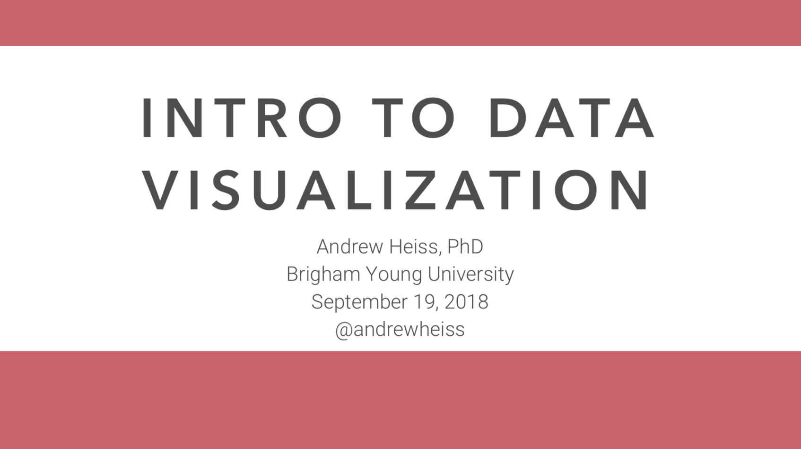

```{r setup, include=FALSE}
knitr::opts_chunk$set(fig.align = "center")
```

# Slides

This R Markdown file [is available on GitHub](https://github.com/andrewheiss/talks/tree/master/2018-09-19_uvu-dataviz).

[Download the slides from today's talk](presentation/andrew-heiss_2018-09-19_uvu-dataviz.pdf)

```{r first-slide, echo=FALSE, out.width='50%', fig.align='center'}

```


# Resources

## Books

If you want to learn enough graphic design to be dangerous, *get this book*:

- Robin Williams, *The Non-Designer’s Design & Type Books: Design and Typographic Principles for the Visual Novice, Deluxe Edition.* (Berkeley, California: Peachpit Press, 2008). (Or any more recent version too)

There are some helpful summary articles about CRAP principles online too:

- [It’s all C.R.A.P.: Four Principles of Design](http://www.thinkaroundcorners.com/2011/10/c-r-a-p-principles-design/)
- [Build Better User Experience With C.R.A.P. Design Principles](https://vwo.com/blog/crap-design-principles/)

There are a ton of excellent data visualization books, including two new (free!) books by Kieran Healy and Claus Wilke:

- [Kieran Healy, *Data Visualization for Social Science: A practical introduction with R and ggplot2*](http://socviz.co/)
- [Claus Wilke, *Fundamentals of Data Visualization*](http://serialmentor.com/dataviz/)
- Alberto Cairo, *The Truthful Art: Data, Charts, and Maps for Communication* (Berkeley, California: New Riders, 2016).
- Stephanie D. H. Evergreen, *Effective Data Visualization: The Right Chart for the Right Data* (Thousand Oaks, CA: Sage, 2017).
- Dona M. Wong, *The Wall Street Journal Guide to Information Graphics: The Dos and Don’ts of Presenting Data, Facts, and Figures* (London: W. W. Norton & Company, 2010).
- Hadley Wickham and Garrett Grolemund, *R for Data Science: Import, Tidy, Transform, Visualize, and Model Data* (Sebastopol, California: O’Reilly Media, 2017). [[FREE online](http://r4ds.had.co.nz/)]
- Alberto Cairo, *The Functional Art: An Introduction to Information Graphics and Visualization* (Berkeley, California: New Riders, 2013).

## How to select the appropriate chart type

Many people have created many useful tools for selecting the correct chart type for a given dataset or question. Here are some of the best:

- [**The Data Visualisation Catalogue**](http://www.datavizcatalogue.com/): Descriptions, explanations, examples, and tools for creating 60 different types of visualizations.
- [**The Data Viz Project**](http://datavizproject.com/): Descriptions and examples for 150 different types of visualizations. Also allows you to search by data shape and chart function (comparison, correlation, distribution, geographical, part to whole, trend over time, etc.).
- [**From Data to Viz**](https://www.data-to-viz.com/): A decision tree for dozens of chart types with links to R and Python code.
- [**The Chartmaker Directory**](http://chartmaker.visualisingdata.com/): Examples of how to create 51 different types of visualizations in 31 different software packages, including Excel, Tableau, and R.
- [**R Graph Catalog**](http://shinyapps.stat.ubc.ca/r-graph-catalog/): R code for 124 ggplot graphs.
- [**Emery's Essentials**](http://annkemery.com/essentials/): Descriptions and examples of 26 different chart types.

## Colors

- [**Adobe Color**](https://color.adobe.com): Create, share, and explore rule-based and custom color palettes.
- [**ColorBrewer**](http://colorbrewer2.org/): Sequential, diverging, and qualitative color palettes that take accessibility into account.
- [**viridis**](https://cran.r-project.org/web/packages/viridis/vignettes/intro-to-viridis.html): Percetually uniform color scales.
- [**Scientific Colour-Maps**](http://www.fabiocrameri.ch/colourmaps.php): Perceptually uniform color scales like viridis. Use them in R with [**scico**](https://github.com/thomasp85/scico).
- [**Colorgorical**](http://vrl.cs.brown.edu/color): Create color palettes based on fancy mathematical rules for perceptual distance.
- [**Colorpicker for data**](http://tristen.ca/hcl-picker/): More fancy mathematical rules for color palettes ([explanation](https://www.vis4.net/blog/posts/avoid-equidistant-hsv-colors/)).
- [**iWantHue**](http://tools.medialab.sciences-po.fr/iwanthue/): Yet another perceptual distance-based color palette builder.
- [**ColourLovers**](http://www.colourlovers.com/): Like Facebook for color palettes.
- [**Photochrome**](https://photochrome.io/): Word-based color pallettes.

## Fonts

- [**Google Fonts**](https://fonts.google.com/): Huge collection of free, well-made fonts.
- [**The Ultimate Collection of Google Font Pairings**](https://www.reliablepsd.com/ultimate-google-font-pairings/): A list of great, well-designed font pairings from all those fonts hosted by Google (for when you're looking for good contrasting or complementary fonts).

## Other helpful data visualization resources {#other-resources}

- [**Storytelling with Data**](http://www.storytellingwithdata.com/): Blog and site full of resources by Cole Nussbaumer Knaflic.
- [**Ann K. Emery's blog**](http://annkemery.com/blog/): Blog and tutorials by [Ann Emery](https://twitter.com/AnnKEmery).
- [**Evergreen Data**](http://stephanieevergreen.com/): Helful resources by [Stephanie Evergreen](https://twitter.com/evergreendata).
- [**PolicyViz**](https://policyviz.com/): Regular podcast and site full of helpful resources by [Jon Schwabisch](https://twitter.com/jschwabish).
- [**\@HelpMeViz**](https://twitter.com/HelpMeViz): Community of people who give advice on how to visualize data.
- [**Visualising Data**](http://www.visualisingdata.com/): Fantastic collection of visualization resources, articles, and tutorials by [Andy Kirk](https://twitter.com/visualisingdata).
- [**Info We Trust**](http://infowetrust.com/): Detailed explorations of visualizations by [RJ Andrews](https://twitter.com/infowetrust), including a [beautiful visual history of the field](http://infowetrust.com/history/).
- [**FlowingData**](https://flowingdata.com/): Blog by [Nathan Yau](https://twitter.com/flowingdata).
- [**Information is Beautiful**](http://www.informationisbeautiful.net/): Blog by [David McCandless](https://twitter.com/mccandelish).
- [**Junk Charts**](http://junkcharts.typepad.com/): Blog by [Kaiser Fung](https://twitter.com/junkcharts).
- [**WTF Visualizations**](http://viz.wtf/): Visualizations that make you ask "What the F^rea^k?"^[ `r emo::ji("speak_no_evil")` o hi byu! `r emo::ji("speak_no_evil")`]
- [**The Data Visualization Checklist**](http://annkemery.com/checklist/): A helpful set of criteria for grading the effectiveness of a graphic.
- [**Data Literacy Starter Kit**](https://docs.google.com/document/d/1kKRadOiF0LruItsvGA40fSDZkAQfCqC_Ela0gBdo8A4/edit): Compilation of resources to become data literate by [Laura Calloway](http://lauracalloway.com/).
- [**Seeing Data**](http://seeingdata.org/): A series of research projects about perceptions and visualizations.
