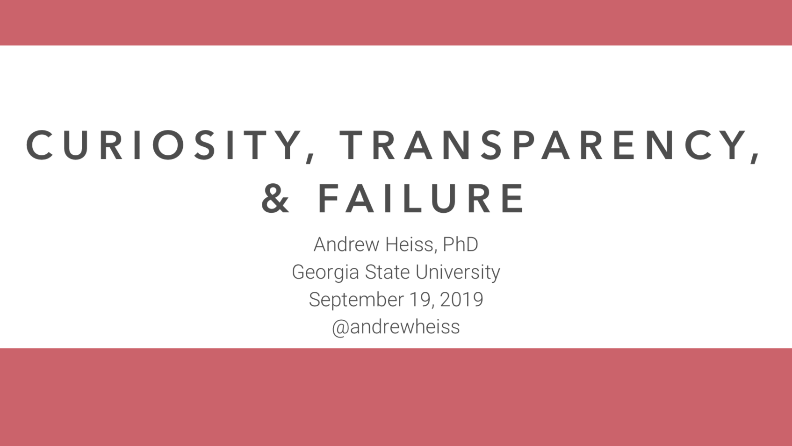

# Curiosity, Transparency, and Failure

[Andrew Heiss](https://www.andrewheiss.com/) • Andrew Young School of Policy Studies • Georgia State University  
Presentation given to epidemiology PhD students at the University of Georgia  
September 19, 2019

---

This repository contains:

- [The PowerPoint file of the presentation](presentation/curiousity-transparency-failure.pptx)
- [A PDF of the presentation](presentation/curiousity-transparency-failure.pdf)

I borrowed themes of this talk from David Robinson's 2019 rstudio::conf talk ["The Unreasonable Effectiveness of Public Work"](https://resources.rstudio.com/rstudio-conf-2019/the-unreasonable-effectiveness-of-public-work) and [his related blog post](http://varianceexplained.org/r/start-blog/).

---

