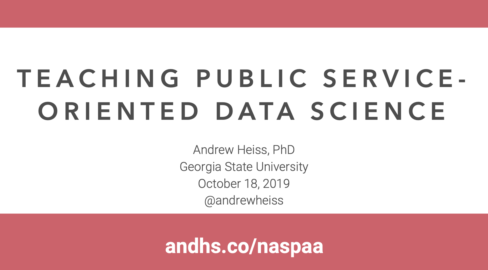

# Open source resources for teaching data public service-focused data science courses

[Andrew Heiss](https://www.andrewheiss.com/) • Andrew Young School of Policy Studies • Georgia State University  
Panel presentation at the 2019 annual conference for the Network of Schools of Public Policy, Affairs, and Administration (NASPAA), Los Angeles, California  
October 18, 2019

---

This repository contains:

- [The PowerPoint file of the presentation](presentation/naspaa19.pptx)
- [A PDF of the presentation](presentation/naspaa19.pdf)

---

