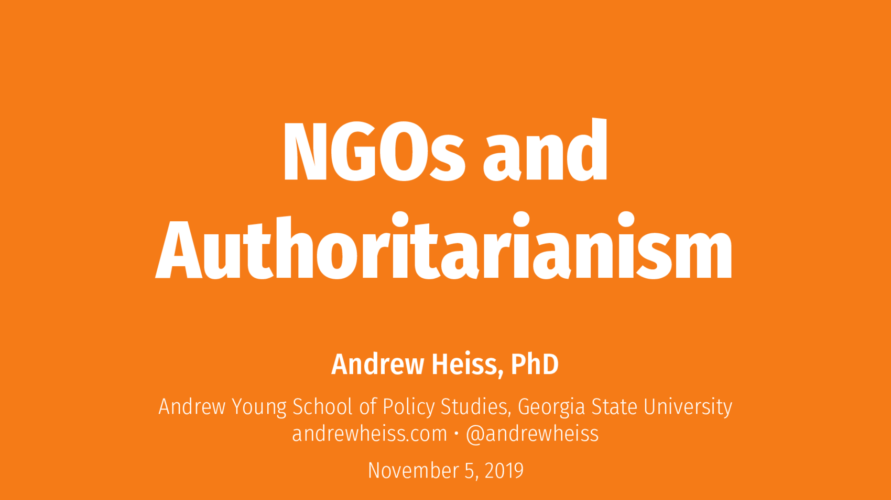

# NGOs and authoritarianism

[Andrew Heiss](https://www.andrewheiss.com/) • Andrew Young School of Policy Studies • Georgia State University  
Guest lecture in International NGOs course (PMAP 8201) at the Andrew Young School of Policy Studies at Georgia State University; Atlanta, Georgia  
November 5, 2019

---

This repository contains:

- [The PowerPoint file of the presentation](presentation/pmap8201f19_ngos-authoritarianism.pptx)
- [A PDF of the presentation](presentation/pmap8201f19_ngos-authoritarianism.pdf)

---

