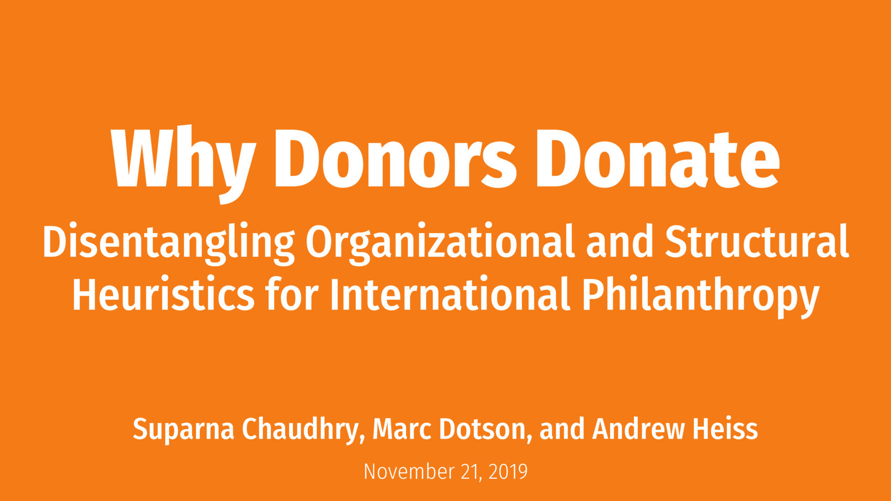

# Why Donors Donate: Disentangling Organizational and Structural Heuristics for International Philanthropy

[Suparna Chaudhry](http://www.suparnachaudhry.com/) • Department of Political Science • Christopher Newport University  
[Marc Dotson](https://marriottschool.byu.edu/directory/details?id=50683) • Marriott School of Business • Brigham Young University  
[Andrew Heiss](https://www.andrewheiss.com/) • Andrew Young School of Policy Studies • Georgia State University

Research presentation at the 2019 annual conference for the Association for Research on Nonprofit Organizations and Voluntary Action (ARNOVA), San Diego, California  
November 21, 2019

---

This repository contains:

- [A PDF of the presentation](presentation/why-donors-donate_arnova19.pdf)

---

