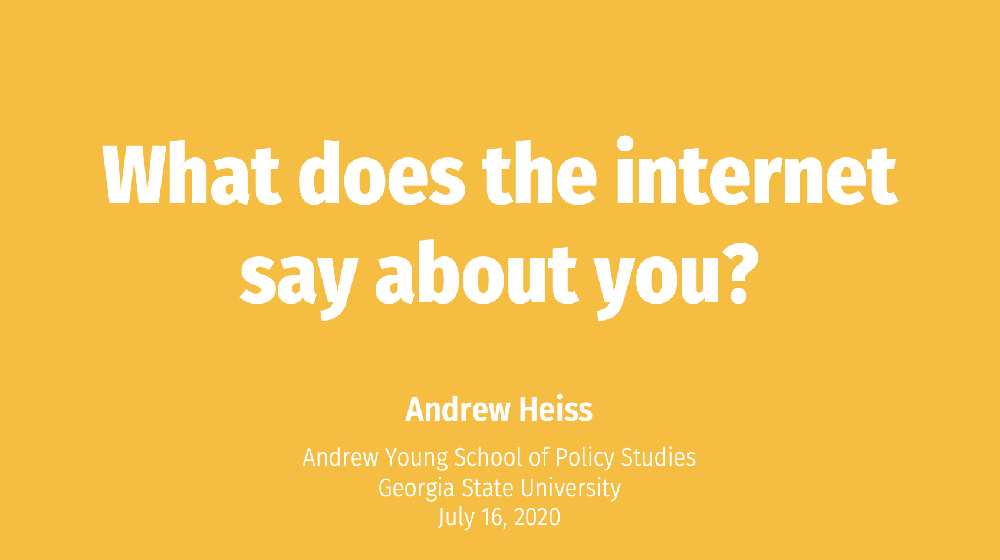

# What does the internet say about you?

[Andrew Heiss](https://www.andrewheiss.com/) • Andrew Young School of Policy Studies • Georgia State University  
Workshop for members of the International Society for Third-Sector Research (ISTR); online webinar with Zoom  
July 16, 2020

---

This repository contains:

- [The PowerPoint file of the presentation](slides/andrew-heiss_istr-internet.pptx)
- [A PDF of the presentation](slides/istr-internet.pdf)

---

